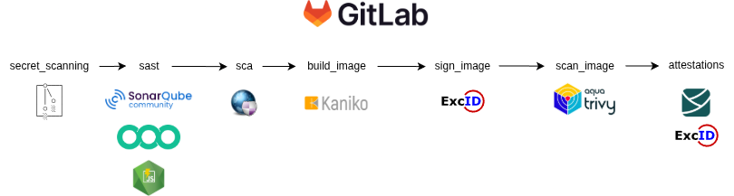
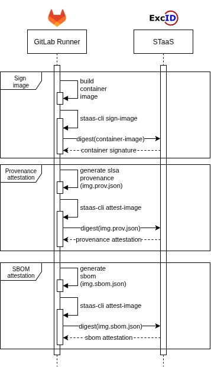

# Secure CI/CD using artifact attestations and container signatures w/ STaaS 

## Acknowledgements
The code provided in this repository has been created in the context of the SecCon project, which is supported and funded by [aerOS](https://aeros-project.eu). 

## Description

A demo pipeline for demonstrating DevPrivSecOps methodology with GitLab CI. Our focus on this repo is mainly on container signatures and artifact attestations and how we use them with STaaS within a pipeline, but a more complete pipeline is built to demonstrate how these attestations could fit within any pipeline.

We use a demo application which is a very simple web app written in NodeJS with express-js (prints hello world in the browser). It is packed into a container and deployed on a machine which runs Kubernetes. 

Regarding continuous Integration (CI), this pipeline automates security checks in the software development lifecycle, integrating multiple stages of security testing. It includes Secret Scanning, SAST (Static Application Security Testing), SCA (Software Composition Analysis), image building, singing and scanning, and artifact attestations. Core tools like Gitleaks, Semgrep, Trivy, and SonarQube are used to detect vulnerabilities, misconfigurations, and secrets within the code and container images.

continuous Deployment (CD) is done using FluxCD. We suppose there is a Kubernetes cluster setup somewhere, and we configure FluxCD to pull the container images from the repository and apply them into the cluster. Flux does not only monitor changes in the OCI registry, but also in k8s infrastructure files (.yaml).

Continuous Deployment is not only about running the containers, but for our case, verification as well. When applying new images in the cluster, we want to verify their signatures, and their artifact attestations. If a malicious image/artifact tries to enter the cluster, during verification tampering should be detected, and thus, reject the changes.

This pipeline promotes a secure CI/CD process by detecting and mitigating security issues as early as possible (shift left security).

**Note**: if you want to get the full benefits out of this repo you have to:
1. follow along with the CI steps:
    - setup a secure CI pipeline (decide on some platform which suits your needs and lay out the steps/jobs)
    - build and **sign** your container images
    - **use attestations** for specific artifacts (like images) which will be later on verified 
    - store signatures and attestations
    - we do not go over on setting up any CI environment, since we use GitLab hosted runners
2. setup a CD procedure:
    - decide on your gitops strategy (here we do monorepo)
    - setup a k8s cluster (in our example we setup a cluster with `minikube`)
    - install `fluxcd` in the cluster
    - installation steps on setting up minikube along with fluxcd and any other verification components are found under `opa/gatekeeper` and `kyverno` folders (we choose to implement Kyverno as a policy engine)

Artifact attestations and signatures ensure the integrity of specific artifacts. We create [Provenance and SBOM](https://slsa.dev) statements and use [STaaS](http://staas.excid.io) to sign them. First, the container's provenance is produced, and then the SBOM. At the `attestations` step of the pipeline, these are signed by sending the digest of the two files mentioned to STaaS (we have a specific python script for that).

At the same time, we sign containers again using STaaS, to ensure their integrity and authenticity.

## Folder structure

- `apps`: contains all .yaml and `kustomization` files for our k8s cluster.
- `assets`: images and other files useful for the repo.
- `attacks`: a folder which contains another `.gitlab-ci.yaml` file. This file is prone to vulnerabilities. This is our way to demonstrate how artifact attestations and container signatures protect from specific attacks.
- `clusters`: the folder that fluxcd monitors. The core file in there is `apps.yaml`. We modify this file to tell flux which kustomization to apply into the cluster.
- `kyverno`: contains installation instructions for minikube and kyverno, as well as some policies that validate container signatures and attestations
- `opa`: contains two subfolders (see the Verification chapter for more). These have to do with attestation and signature verification strategies.


## CI/CD Steps



We briefly describe each step:

1. Secret scanning: we use [gitleaks](https://github.com/gitleaks/gitleaks) to scan the repo for secrets uploaded
2. SAST: we do static analysis on the code
    - [SonarQube](https://www.sonarsource.com/products/sonarqube/): a widely known tool for SAST which scans the code and produces reports on security issues and code quality
    - [Semgrep](https://semgrep.dev/): a lightweight, fast static analysis tool
    - [njsscan](https://github.com/ajinabraham/njsscan): a static application testing (SAST) tool that can find insecure code patterns in your node.js applications 
3. SCA: we use [retirejs](https://github.com/RetireJS/retire.js) to scan the nodejs app for vulnerable dependencies
4. Build image: we build the image using [kaniko](https://github.com/GoogleContainerTools/kaniko), produce the provenance, and push it to GitLab's container registry
5. Container signature: containers are signed directly after building using STaaS
6. Scan image: we use [Trivy](https://trivy.dev/latest/) to scan the container for vulnerabilities and produce the SBOM
7. Attestations: here we take as input the Provenance and the SBOM and pass the to STaaS for signing. There is a python script in the repo which takes as input the file to attest, and right after it **verify** the attestation
    - One job is to attest the Provenance
    - The second job is to attest the SBOM
8. Deploy: supposing there is a K8s cluster running, [FluxCD](https://fluxcd.io/) monitors the OCI registry for changes and pulls the new image and applies it in the cluster
9. Policy enforcement: supposing your preferred policy engine is installed and configured ([Kyverno](https://kyverno.io/) or [OPA Gatekeeper](https://kubernetes.io/blog/2019/08/06/opa-gatekeeper-policy-and-governance-for-kubernetes/)), the container image undergoes some checks and if successful gets applied, otherwise gets rejected
<!-- 10. DAST: ZAP is used to for dynamic testing post-deployment -->

Once the image is uploaded onto the OCI registry (registry.gitlab.com), it is pulled by FluxCD, and applied into the cluster.


## Attestations and STaaS

With artifact attestations we can ensure the integrity of our artifacts by creating the so called *attestation*. This is a **signed** document (signed using [Sigstore](https://www.sigstore.dev/)) which includes attributes for the subject(s) being signed. This is very good practice especially in CI/CD pipeline where signing **and verification** can be done automatically. 

When verifying, we can also set some expectations. For example, is the container image version stored in the attestation the one I built?, or is the repository url stored in the attestation the real one - or a typosquatted one? In more complicated scenarios, we can have a policy engine (like Kyverno or OPA Gatekeeper) which contains our own policy, we feed in the attestation, and based on the policy it outputs true/false, or trust/no trust.

GitLab [supports](https://about.gitlab.com/blog/2022/08/10/securing-the-software-supply-chain-through-automated-attestation/) artifact **provenance** by setting the variable `RUNNER_GENERATE_ARTIFACTS_METADATA: "true"` in the pipeline (or in a specific job). By setting this variable, all declared artifacts in a job will have their provenance generated. See [here](https://docs.gitlab.com/ci/yaml/signing_examples/#inspecting-the-provenance-metadata) for a sample GitLab provenance.

The scope of the project is to generate the provenance and SBOM attestation of a container image, plus sign the container image. 

- For the provenance this means, how the image was built, what was its build system (i.e., the GitLab runner), what was the commit id, what was the job id, what were the values for some etc. 
- For the SBOM this means, what are the dependencies of the codebase/container image
- For the signature this means, who and when signed the image (ensures integrity and authenticity) 

In order to create the attestation for this provenance we use STaaS, a Software Transparency service. Using the script `staas-upload.py` we send one digest for the provenance file and one for the SBOM to STaaS, and for each one of them it signs the digest digest.




<!-- ## Project Components

Here we outline what components we used for running this PoC.

1. **GitLab**
    - We use GitLab to upload our code and version control it online.
2. **GitLab CI**
    - We use GitLab CI to run our DevPrivSecOps pipelines. We use the GitLab hosted runners (we do not install our own) to execute the pipeline.
3. **STaaS**
    - We use STaaS to sign our documents. -->

## Attack scenarios

In this repo we present some attack scenarios. See `README.ATTACKS.md` for more.

## Verification

In order to verify signatures and attestations, either Kyverno or OPA Gatekeeper can be used. We are most intrested in verifying these, within the context of a Kubernetes cluster. Kyverno is the predominant policy engine for Kubernetes. OPA Gatekeeper is also a good option, but does not offer the same range of capabilities as Kyverno (even though it is powerful). 

Under the folder `kyverno` we explain how to use kyverno and provide some policies. This scenario is of most interest, because during Continuous Deployment we can verify our requirements on the fly and, exactly pre-deployment, reject malicious images.

Under the folder `opa` we have two distinct cases of verification.
1. One under `standalone` folder
2. One under `gatekeeper` folder

The first one is about using a standalone instance of OPA to verify attestations, and some Rego policies accompanying it. This may - or may not - be suitable for CD cases (in reality, it is not the best option).

The second one is about using OPA Gatekeeper as a K8s component for continuous deployment cases, where conitnuous verification is also required.

## Self Hosting

You can always run these pipelines using your own self-hosted GitLab runner. Try the following command to register a runner locally:
```sh
sudo gitlab-runner register \
    --non-interactive \
    --url https://gitlab.com/ \
    --token token \
    --run-untagged="true" \ 
    --executor "docker+machine" \
    --docker-image python:3.9
sudo gitlab-runner run
```

Match the settings to your preferences and security requirements.