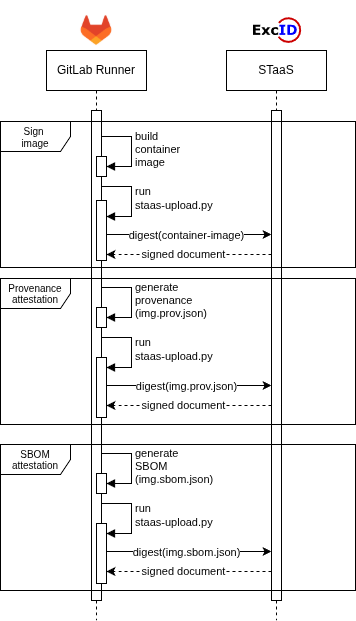

# excid-cicd-demo-project

## Description

A demo pipeline for demonstrating DevPrivSecOps methodology with GitLab CI. Our focus on this repo is mainly on artifact attestations and how we use them with STaaS within a pipeline, but we build a more complete pipeline to demonstrate how these attestations could fit within any pipeline.

We use a demo application which is a web game for playing with dice, written in NodeJS. It is packed into a container and deployed on a machine which contains Docker. A mysql container also needs to exist in the same machine which acts as the database for the web app container.

This pipeline automates security checks in the software development lifecycle, integrating multiple stages of security testing. It includes Secret Scanning, SAST (Static Application Security Testing), SCA (Software Composition Analysis), Image Building and Scanning, Artifact Attestations, Deployment, and DAST (Dynamic Application Security Testing). Key tools like Gitleaks, Semgrep, Trivy, and SonarQube are used to detect vulnerabilities, misconfigurations, and secrets within the code and container images. DAST (Dynamic Application Security Testing) with ZAP scans the deployed application for vulnerabilities. This pipeline promotes a secure CI/CD process by detecting and mitigating security issues early.

Artifact attestations ensure the integrity of specific artifacts. We create [Provenance and SBOM](https://slsa.dev) statements and use [STaaS](http://staas.excid.io) to sign them. The provenance is produced for the container, and then the SBOM. At the `attestations` step of the pipeline, these are signed by sending the digest of the two files mentioned to STaaS (we have a specific python script for that).

## Steps

We briefly describe each step:

1. Secret scanning: we use [gitleaks](https://github.com/gitleaks/gitleaks) to scan the repo for secrets uploaded
2. SAST: we do static analysis on the code
    - SonarQube: a widely known tool for SAST which scans the code and produces reports on security issues and code quality
    - Semgrep: a lightweight, fast static analysis tool
    - njsscan: a static application testing (SAST) tool that can find insecure code patterns in your node.js applications 
3. SCA: we use retirejs to scan the nodejs app for vulnerable dependencies
4. Docker build: we build the image using docker, produce the provenance, and push it to GitLab's container registry
5. Scan image: we use Trivy to scan the container for vulnerabilities and produce the SBOM
6. Attestations: here we take as input the Provenance and the SBOM and pass the to STaaS for signing. There is a python script in the repo which takes as input the file to attest, and right after it **verify** the attestation
    - One job is to attest the Provenance
    - The second job is to attest the SBOM
7. Deploy: we deploy the container built to a machine using ssh and a simple docker run command
8. DAST: ZAP is used to for dynamic testing post-deployment

## Attestations and STaaS

With artifact attestations we can ensure the integrity of our artifacts by creating the so called *attestation*. This is a **signed** document (signed using [Sigstore](https://www.sigstore.dev/)) which includes attributes for the subject(s) being signed. This is very good practice especially in CI/CD pipeline where signing **and verification** can be done automatically. 

When verifying, we can also set some expectations. For example, is the version stored in the attestation the one I built?, or is the repository url stored in the attestation the real one? In more complicated scenarios, we can have a policy engine (like OPA) which contains our own policy, we feed in the attestation, and based on the policy it outputs true/false, or trust/no trust.

GitLab [supports](https://about.gitlab.com/blog/2022/08/10/securing-the-software-supply-chain-through-automated-attestation/) artifact **provenance** by setting the variable `RUNNER_GENERATE_ARTIFACTS_METADATA: "true"` in the pipeline (or in a specific job). By setting this variable, all declared artifacts in a job will have their provenance generated. See [here](https://docs.gitlab.com/ci/yaml/signing_examples/#inspecting-the-provenance-metadata) for a sample GitLab provenance.

The purpose here is to generate the provenance and SBOM attestation of a container image. 

- For the provenance: this means, how the image was built, what was its build system (i.e., the GitLab runner), what was the commit id, what was the job id, what were the values for some etc. 
- For the SBOM: this means that the SBOM is tied to the corresponding container image

In order to create the attestation for this provenance we use STaaS, a Software Transparency service. Using the script `staas-upload.py` we send one digest for the provenance file and one for the SBOM to STaaS, and for each one of them it signs the digest digest.

## Project Components

Here we outline what components we used for running this PoC.

1. **GitLab**
    - We use GitLab to upload our code and version control it online.
2. **GitLab CI**
    - We use GitLab CI to run our DevPrivSecOps pipelines. We use the GitLab hosted runners (we do not install our own) to execute the pipeline.
3. **STaaS**
    - We use STaaS to sign our documents.

## Attack scenarios

In this repo we present some attack scenarios. See `README.ATTACKS.md` for more.

## Verification

We have two distinct cases of verification in this repo.
1. One under `policy` folder
2. One under `k8s/gatekeeper` folder

The first one is about using a standalone instance of OPA to verify attestations, and some Rego policies accompanying it.

The second one is about using OPA Gatekeeper as a K8s component for continious deployment cases, where conitnious verification is also required.