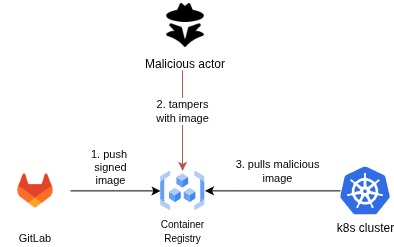

# Attack scenarios & Mitigations

In this repo we also consider how attestations protect from specific attack scenarios. We provide en extra yaml file which is vulnerable (`vulnerable.gitlab-ci.yml`)

***Note***: GitLab CI can only have **one** `.gitlab-ci.yml` file in the repo which runs the pipeline and **must** be in the project root direct, so rename the file you want to run accordingly, and backup the old one.

The purpose is to show how a vulnerable `.gitlab-ci.yml` file can be exploited, and how attestations and signatures protect from such attacks. We use *Kyverno* to verify the attestations. More details about *Kyverno* and its functionality see the folder *Kyverno* in the repo.

Let's consider the following example: if our repo's name is `excid-cicd-demo-project`, the attacker can create another repo which is typosquatted, like `excid-civd-demo-project`, and upload a pipeline which executes `docker build excid-civd-demo-project`, and thus, builds and pushes a malicious copy of our project.

Attacks covered in this repo are mostly related to the threats mentioned in the [SLSA specification threat list](https://slsa.dev/spec/v1.0/threats-overview), one dependency attack to showcase how the SBOM attestation can protect from vulnerable dependencies, typosquatted dependencies etc, plus one attack regarding signing from an unauthorized party.

Scenarios considered:

| Scenario                                         | Description                                                                                                                                                            | Remediation                                                                                                                 |
|--------------------------------------------------|------------------------------------------------------------------------------------------------------------------------------------------------------------------------|-----------------------------------------------------------------------------------------------------------------------------|
| Build from malicious source (another repository) | We have a typosquatted version of the project as mentioned above, which just outputs a message "Malicious" in the HTML served | In the verification policy of the SLSA provenance attestation, explicitly check if the repo in the predicate is equal to the official repo          |
| Build from previous commit hash                  | Instead of building from the latest commit, the pipeline builds from a previous version which is vulnerable.                                                          | In the verification policy of the SLSA provenance attestation, check that the package/container image built, corresponds to the latest commit hash                                  |
| Build with compromised dependency                | Import a malicious dependency                                                                                                                                          | Generate SBOM attestation, and check against names and versions of dependencies that are highly significant for the project |
| Unauthorized build/signing                | The image was built and signed by an unauthorized entity                                                                                                                                          | When verifying the container image signature check that only authorized entities and OIDC issuers participated in the signing (e.g., only GitLab runners can sign with OIDC issuer gitlab.com, so an image cannot be signed by some enitity **@gmail.com*) |
<!-- | Build from non-registered/malicious runner       | Build with a runner that is not registered in my infrastructure (mostly for cases including self-hosted runners)                                                       | In the verification policy of the SLSA provenance attestation, have a list of registered runners (their tokens) and check if the attestation contains a name that is in this list                                              | -->

Other possible scenarios (out of scope):

- Submit unauthorized changes in source code -> two-person review
- Compromise source repo -> branch protection, harden VCS

## Scenario 1

We require our images to be signed during Continuous Integration. This ensures integrity and authenticity. If images are unsigned, anyone can make malicious changes to the image and they will remain undetected. So now with container signatures, we require some trusted entities (e.g., the GitLab runner) to sign the image.

The policy engine should ensure that the image is signed by the appropriate party.

## Scenario 2

Another way attestations can protect from attacks, is by creating the SBOM attestation. This way, we have an authenticated document stating that some dependencies exist in our codebase.
If some dependency is known to be vulnerable or malicious, we can capture it in the SBOM and stop Continuous Deployment.

Generally, the SBOM is a very big json file and because some dependencies are loaded transitively, it is not easy/possible to check all of them. So we can pick a handful of them, and craft a policy that checks only for nitpicked dependencies. For example, in our express-js server we can have Kyverno check that the version of express-js (a core library included) is greater than 4.

## Scenario 3

Build from malicious source (different repository than the intended). In this scenario, we consider that someone created a repoository with a different name than the official one, and modifies the original CI pipeline so that it builds the code from the malicious repository.

Now, because SLSA defines that the **build platform is trusted**, we consider the attestation produced as an **honest** document. 
<ins>Remember</ins>, attestations are signed documents, which means that if someone tampered with it (e.g., change `subject` field in the attestation) this will be visible.

After the malicious pipeline has run, when verifying, we can run some checks like the following: 

If the check above succeeds, then the repo is the original one. Otherwise, we fail the CD and do not deploy the container image.

## Scenario 4

Contrary to the previous one, now the attackers build the same project - the official one - but from a previous version which is known to have vulnerabilities.

In the policy there should be a check included that looks for the commit hash. It must ensure that it is always equal to the latest commit.

<!-- ## Scenario 3

Another threat is building from an unknown build system. If an adversary deploys a malicious GitLab runner, within the infrastructure and register it with the repository, then this runner can take on jobs submitted by legit users and act illegally.

Why is there a need to worry for that? Don't we trust the build platform? Yes, but, it has been [reported](https://frichetten.com/blog/abusing-gitlab-runners/) for GitLab runners that there is a race condition vulnerability where malicious runners can request to run submitted pipelines before legit ones. Obviously, this runner can then run whatever pipeline it wants, and upload a malicious container image.

Having that in mind, we can verify two things:
1. verify all binaries pre-installation (out of scope for artifact attestations)
2. verifying that the GitLab runner token is indeed created by a trusted entity, and Kyverno knows about this token

Attestation-wise, in the provenance attestation we can check the field of -->

