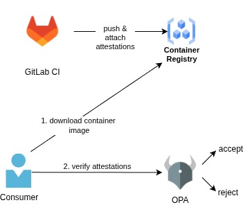

## Artifact attestation verification with Open Policy Agent (OPA)

### Prerequisites
OPA binary is installed in your system.

### Description

Here, we have some simple REGO files which run some checks against our provenance and sbom attestations. In this README, we see how OPA as a **standalone** running server works with some custom input (policies+data+input) to validate our attestations. The present file has **nothing** to do with Continuous Deployment cases (although can fit in).

An exemplary use case that this README applies to is, when a consumer wants to download a container image locally, but also wants to verify the attestations before running the container. It does not fit in the context of Kubernetes-like continuous verification. 



The container image signature verification is **not** done by OPA, we assume that it was done in a previous step using `cosign` or a similar tool.
We have two policies:
- One in *verify-slsa.rego*
- One in *verify-sbom.rego*

For the SLSA provenance we check that the statement has a predicateType of `https://slsa.dev/provenance/v1`, to ensure that it is indeed a provenance statement. After that, we need to set other expectations for verification. We know beforehand that the attestation the we will feed into the OPA Engine is generated by our GitLab pipeline. That's why, for our case, we set some constant expectations like the `approved_repos` or `approved_runners`.

Similarly, for the SBOM, we know that we have an express-js app, that's why the policy checks that the version of the policy is greater than 4 (no particular reason, just for demo purposes).

### Run the tests

To run some of the provided tests, we provide sample attestation json files and policies. Try running:

```sh
opa eval -d opa/standalone/verify-slsa.rego -i opa/standalone/demo-files/prov-att-gl.json "data"  # should fail because the expectation
opa eval -d opa/standalone/verify-sbom.rego -i opa/standalone/demo-files/sbom-att.json "data"  # should pass because express-js > 4
```

**Note**: images, repos and requirements have changed since authoring these Rego policies, so it is not clear if these conditions should pass or fail (probably they all fail). So, try passing your own parameters and verify your attestations for your images.